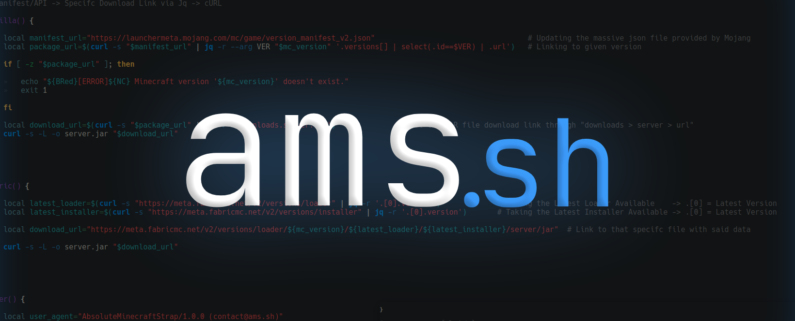
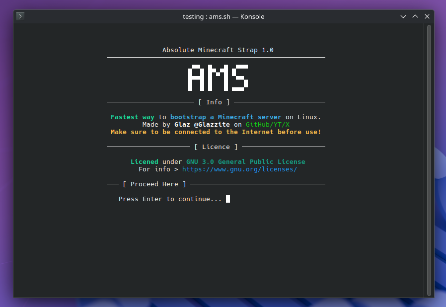

<h1 align="center">

**Absolute Minecraft Strap**



</h1>

<div align="center">

*"The fastest way to bootstrap a Minecraft server on Linux."*


</div>

<div align="center">

ams.sh is a _lightweight_, deployment, **bootstrap script** designed to **spin up a production-ready, Java Minecraft server** in under **5 minutes**. By condensing _environment configuration_, _dependency management_, and _EULA automation_ into a **single execution**, it **eliminates the friction** of manual setup, delivering a **clean, unbloated instance every time**. 

</div>


# 📘 Installation

There are **3 methods** to install the script, all needing a **bash commandline/terminal**.

### 1. cURL (simplest)
```
curl -sSL https://github.com/Glazzite/ams.sh/releases/download/v1.0/ams-v1.0.sh | bash
```

### 2. Releases
Latest versions of the script will be downloadable in the Release tab of this repo. Once downloaded,
```
cd /{saved-directory}/
chmod +x ams.sh
./ams.sh
``` 

### 3. Repo Cloning
``` 
git clone https://github.com/Glazzite/ams.sh
cd ams.sh
chmod +x ams.sh
./ams.sh
```

# 👀 Preview




# 📕 Information

> [!NOTE]
> This script is has **online-based functions**, so make sure to **stay connected to the internet** before use. 😊

### ❓ Why?
To use a **repurposable script** ->
- To automate any MC server setup
- For people who often makes new serers
- For beginners who don't know how to make one

### 💻 Operating System
This script is **made for Linux (GNU/Linux)**, specifcally,
- [x] Ubuntu/Debain (apt)
- [x] Fedora (dnf)
- [x] Arch Linux (pacman/yay)

As this scirpt installs packages via the native package manager of said distros.

> [!NOTE]
> Packages installed are Java Runtine & Jq.

### ⛏ Minecraft Version
**All server supported MC versions** are can be made using this script.
With support to loaders. Currently :
- [x] Vanilla
- [x] Fabric
- [x] PaperMC

# 🧪 Features List

- [x] User-Friendly Guided Install
- [x] Multi-MC Version Capability
- [x] Vanilla / Fabric / Paper Loader Support
- [x] Automated Optimizations + Easy 1-click Server Start (run.sh)
- [x] apt / dnf / pacman / yay Package Manager Support
- [x] API/Manifest Accessed Algorithm (meaning, this script will support all future MC versions!)

OS Capability
- [x] Arch Linux
- [x] Linux Distros
- [ ] SteamOS [NEED TESTERS!!]

> [!IMPORTANT]
> The script will be 100% Bash/Shell written and will not use any external languages.

# 🔔 Credits
- **Code written by Glazzite**.
- **Licensed** under **GNU 3.0 General Public License**.

# 🍵 Buy me some tea?
Donating isn't necessary, just a reminder.
> nah nvm, don't send me money, im too broke for that T-T


<h2 align="center">
🙏 Thank you!
  
Have fun with the script! 🤍
</h2>

<h4 align="center">
"Shattering Limits."
</h4>


